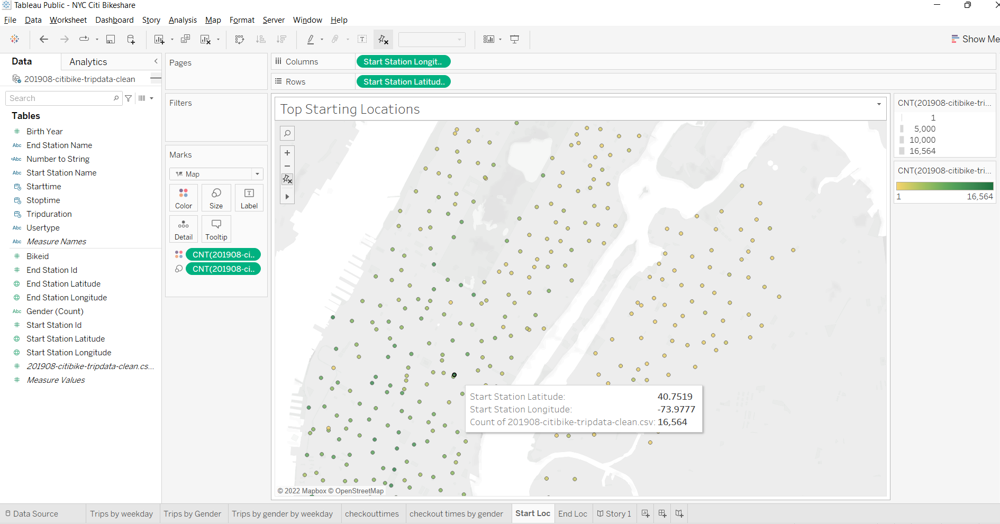
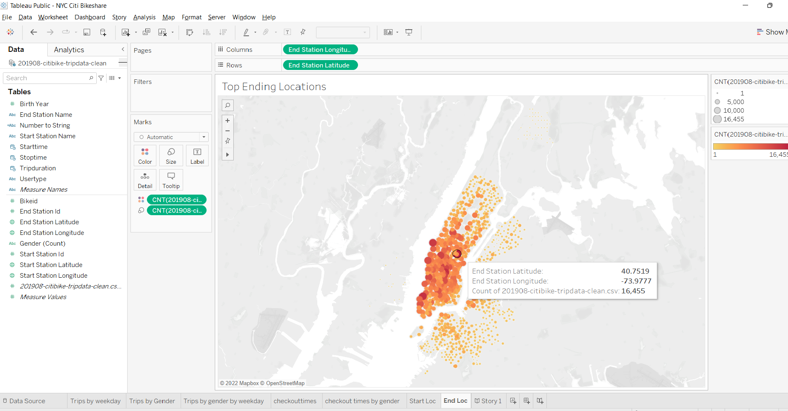
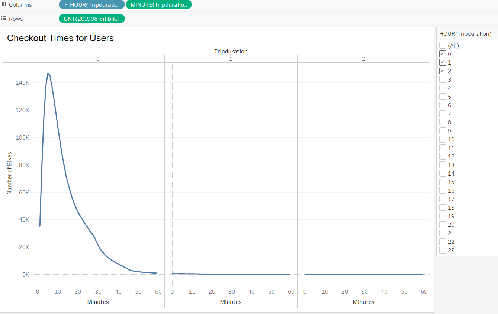
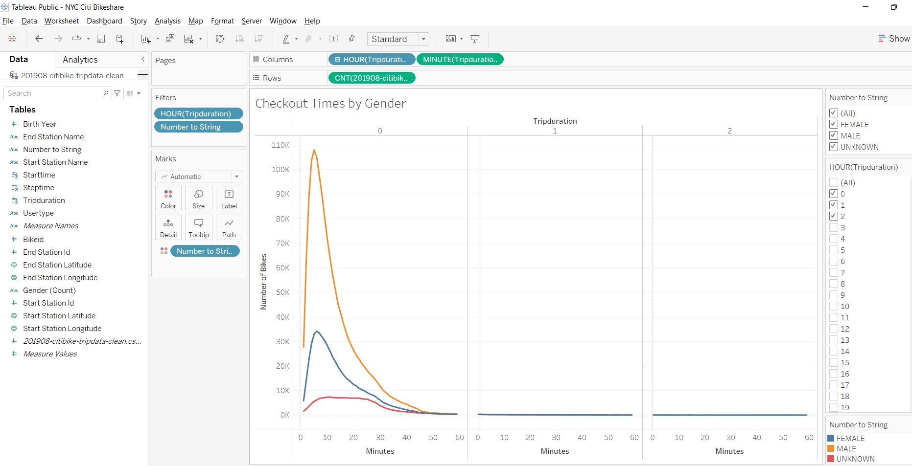
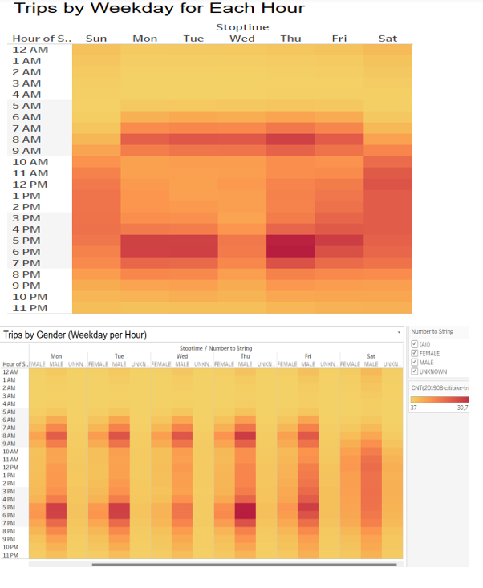
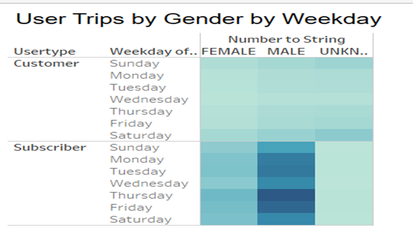

# NYC-Bikeshare
## Overview of the analysis: 
The purpose of this analysis is to use Tableau to display multiple visualization stories for  the NYC Citi bike share data and leverage those analysis results for a business proposal to start a similar bike share program in Des Moines. The story can be found  [here](https://public.tableau.com/app/profile/lalitha1731/viz/NYCCitiBikeshare/Story1?publish=yes)
## Results: 
### Top Start and End Locations

The top start and end locations latitude and longitude are displayed

### Tripduration

The trip duration analysis shows that males utilize the bike sharing program the most for an average of 5 minutes or under.

### Trips by gender,weekday and by the hour

The following analaysis show that busiest hours are Thursdays 5-6 pm follwed by Monday and Tuesday.As noted earlier, males utilize the service more than females. Every evening, from 10pm to morning 6am the usage is very minimal.

## Summary: 

From the different visualization stories, we can see that males take advantage of  the bike share facility the most. Interesting to note that more than 50% of the trip duration average at 5 minutes or under. For the month of August, the busiest hours are Thursdays between 5-6 pm , followed by Monday and Tuesday 5-6 pm.
We need to analyze additional months and years of data to identify if there are any trends in the timings and /or months that are consistently busy for bike share. That information would help us to understand if there are additional bikes needed for that time of the month or year. 
We can have a survey and analyze the results to check the general feedback, comfort, safety and experience of the bike riders and use that data to make informed decisions.

